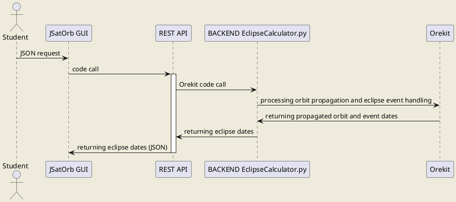

# JSatOrb Project: Eclipse Calculator 

This code computes eclipse calculation for the Earth (WGS84) and the Sun.


## Prerequisites

- Python3.7
- A specific Python environment (named JSatOrbEnv) containing the following packages (installed through the conda-forge channel):
        - Orekit 10.2 (embedding hipparchus),
        - jinja2,
        - and bottle.


## Launch the service

This module is accessible through the JSatOrb centralized REST API which can be launched using the following commands:

Go into the REST API folder
```
cd jsatorb-rest-api
```
Activate the conda/python environment
```
conda activate JSatOrbEnv
```
Run the REST API
```
python src/JSatOrbREST.py
```
By default the service is running on the **port 8000**.


# Run the tests

To run the tests, use the following command:  
```python test/Test[TEST_NAME].py``` where [TEST_NAME] is the name of the test to run or  
if you already ran the global tests script (`runAllTests.sh`) from the `jsatorb` module, you should have a `runTests.sh` script available in this module folder.

In this case, you can run it directly:  
```./runTests.sh```
This script will run all tests available in the test folder (all files satisfying the test/Test*.py pattern).


## Eclipse Request Example

This request to the REST API contains a demand to the backend to process an Eclipse calculation of the Sun by the Earth, from a given satellite from the 1st to the 2nd of December 2011.  

Route : '/propagation/eclipses', POST method
```json
{
  "header": {
    "timeStart": "2011-12-01T16:43:45",
    "timeEnd": "2011-12-02T16:43:45"
  },
  "satellite": {
      "type": "keplerian",
      "sma": "7128137.0",
      "ecc": "0.007014455530245822",
      "inc": "98.55",
      "pa": "90.0",
      "raan": "5.191699999999999",
      "meanAnomaly": "359.93"
  }
}
```


## Eclipse Response Example

The response is an array of sunlight time intervals.

Example of response:

```json
[
  {
    "start": "2011-12-01T16:43:45.000",
    "end": "2011-12-01T17:01:36.742"
  },
  {
    "start": "2011-12-01T18:09:02.781",
    "end": "2011-12-01T18:41:25.530"
  },
  {
    "start": "2011-12-01T19:48:50.910",
    "end": "2011-12-01T20:21:14.317"
  },
  {
    "start": "2011-12-01T21:28:39.042",
    "end": "2011-12-01T22:01:03.104"
  },
  {
    "start": "2011-12-01T23:08:27.175",
    "end": "2011-12-01T23:40:51.892"
  },
  {
    "start": "2011-12-02T00:48:15.310",
    "end": "2011-12-02T01:20:40.679"
  },
  {
    "start": "2011-12-02T02:28:03.446",
    "end": "2011-12-02T03:00:29.467"
  },
  {
    "start": "2011-12-02T04:07:51.585",
    "end": "2011-12-02T04:40:18.254"
  },
  {
    "start": "2011-12-02T05:47:39.725",
    "end": "2011-12-02T06:20:07.042"
  },
  {
    "start": "2011-12-02T07:27:27.867",
    "end": "2011-12-02T07:59:55.830"
  },
  {
    "start": "2011-12-02T09:07:16.011",
    "end": "2011-12-02T09:39:44.617"
  },
  {
    "start": "2011-12-02T10:47:04.157",
    "end": "2011-12-02T11:19:33.405"
  },
  {
    "start": "2011-12-02T12:26:52.304",
    "end": "2011-12-02T12:59:22.192"
  },
  {
    "start": "2011-12-02T14:06:40.453",
    "end": "2011-12-02T14:39:10.980"
  },
  {
    "start": "2011-12-02T15:46:28.604",
    "end": "2011-12-02T16:18:59.768"
  }
]
```

Some other examples can be found [in the files here](./test-rest/eclipseCalculator-request.http).

## Module's sequence diagram



``` 
JSatOrb client can be the Web GUI or a batch client.
The REST API is the centralized REST API which code is in the jsatorb-rest-apî/JSatOrbREST.py Python module.
The back-end code is in the jsatorb-eclipse-service/EclipseCalculator.py Python module.
```
